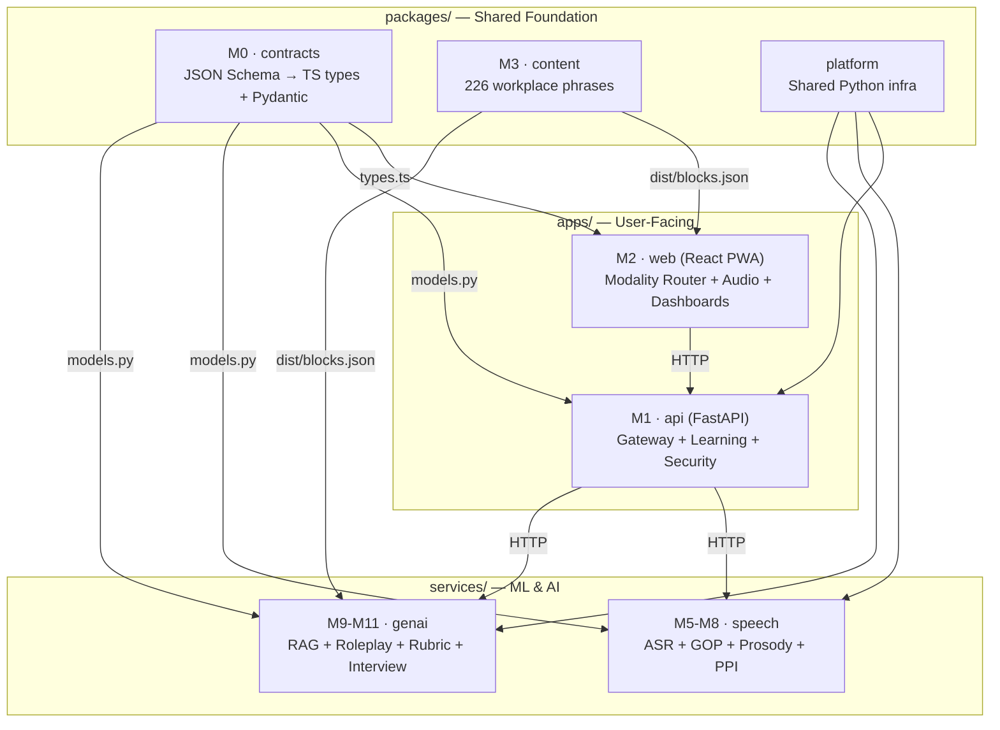

# SAMVAAD — Detailed Module Breakdown

> **S**upportive **A**ccessible **M**ultimodal **V**irtual **A**ssistant for **A**daptive **D**ialogue
>
> An ability-adaptive multimodal AI coach for workplace communication & employability for persons with disabilities.

This document describes **every module** in the codebase and what has been technically implemented so far.

---

## Architecture Overview



---

## 1. `packages/contracts` — Module M0 ★

> [README](file:///c:/Users/Welcome/Desktop/Workplace%20CT/packages/contracts/README.md) · The data contracts everything depends on.

### What it is

The **single source of truth** for every data shape in the system. Four JSON Schema (draft-07) files define the contracts; TypeScript types and Pydantic v2 models are **code-generated** from them — never hand-edited.

### Schemas implemented

| Schema File | Purpose |
|---|---|
| [common.schema.json](file:///c:/Users/Welcome/Desktop/Workplace%20CT/packages/contracts/schemas/common.schema.json) | Shared enums & value objects — `InputMode`, `OutputChannel`, `Difficulty`, `DisabilityProfile`, etc. |
| [content-block.schema.json](file:///c:/Users/Welcome/Desktop/Workplace%20CT/packages/contracts/schemas/content-block.schema.json) | **`ContentBlock`** — a piece of learning content with a canonical meaning + a bundle of representations (audio, ISL clip, pictographs, Easy-Read, phonemes) but **no chosen rendering**. The Modality Router picks at runtime. |
| [learner-response.schema.json](file:///c:/Users/Welcome/Desktop/Workplace%20CT/packages/contracts/schemas/learner-response.schema.json) | **`LearnerResponse`** — any learner answer (spoken, typed, signed, tapped) normalised to a comparable `canonical_text`. One scoring engine serves all modalities. |
| [communication-ability-profile.schema.json](file:///c:/Users/Welcome/Desktop/Workplace%20CT/packages/contracts/schemas/communication-ability-profile.schema.json) | **`CommunicationAbilityProfile`** (CAP) — what the learner can actually use. Built during onboarding, versioned (never updated in place). |

### Generated outputs

| File | Consumers |
|---|---|
| [generated/types.ts](file:///c:/Users/Welcome/Desktop/Workplace%20CT/packages/contracts/generated/types.ts) (11 KB) | `apps/web` (React frontend) |
| [generated/models.py](file:///c:/Users/Welcome/Desktop/Workplace%20CT/packages/contracts/generated/models.py) (16 KB) | `apps/api`, `services/speech`, `services/genai` (all Python backends) |

### Runtime guards

| File | What it does |
|---|---|
| [src/guards.ts](file:///c:/Users/Welcome/Desktop/Workplace%20CT/packages/contracts/src/guards.ts) | `FALLBACK_CHAIN` — defines degradation order when a representation is missing (e.g., `isl → captioned_text → easy_read`). Runtime behaviour a static schema cannot express. |
| [src/index.ts](file:///c:/Users/Welcome/Desktop/Workplace%20CT/packages/contracts/src/index.ts) | Public export surface for TypeScript consumers. |

### Accessibility gate (3-pass validation)

| Pass | What it proves |
|---|---|
| **1 · Schema** | Blocks are well-formed. `fixtures/invalid/` items are correctly rejected. |
| **2 · Accessibility** | Every block is reachable by all 5 personas. 6 rules (A11Y-1 through A11Y-6) protecting Deaf, low-vision, motor-impaired, intellectually disabled, and dysarthric/stammering learners. |
| **3 · Gate self-test** | `fixtures/inaccessible/` items (schema-valid but persona-excluding) are caught — proving the gate itself works. |

### Key design decisions
- JSON Schema is the single source of truth; CI fails if generated output drifts
- Content is **modality-neutral** — authors never choose how something renders ([ADR-0001](file:///c:/Users/Welcome/Desktop/Workplace%20CT/docs/ADR/0001-modality-neutral-content.md))
- All input modes normalise to `canonical_text` — one scoring path for all disabilities ([ADR-0002](file:///c:/Users/Welcome/Desktop/Workplace%20CT/docs/ADR/0002-canonical-text-response.md))

---

## 2. `packages/content` — Module M3

> [README](file:///c:/Users/Welcome/Desktop/Workplace%20CT/packages/content/README.md) · The Workplace Language Bank.

### What it is

**226 curated workplace phrases** across 14 categories, stored in a compact authoring format. The build pipeline expands each one-liner into a full `ContentBlock`. This corpus is the spaced-repetition deck, the RAG grounding set for role-play, and the vocabulary constraint that keeps the LLM in scope.

### The 14 phrase categories

| # | Category | Count | Notes |
|---|---|---|---|
| 01 | Greetings & introductions | 18 | |
| 02 | Asking for clarification | 20 | |
| 03 | Reporting progress | 18 | |
| 04 | Requesting help | 16 | |
| 05 | Leave & workplace adjustments | 18 | ★ No competitor covers this |
| 06 | Disagreeing politely | 14 | |
| 07 | Giving & receiving feedback | 14 | |
| 08 | Telephone etiquette | 14 | |
| 09 | Email & written messages | 16 | |
| 10 | Meetings & standups | 16 | |
| 11 | Safety & escalation | 16 | |
| 12 | Small talk & belonging | 14 | |
| 13 | Interview language | 20 | |
| 14 | Self-advocacy & disclosure | 12 | ★ No competitor covers this |

Source files: [phrases/](file:///c:/Users/Welcome/Desktop/Workplace%20CT/packages/content/phrases) — 14 JSON files, one per category.

### Build & validation pipeline

| Source file | Role |
|---|---|
| [src/build.mjs](file:///c:/Users/Welcome/Desktop/Workplace%20CT/packages/content/src/build.mjs) | Expands compact author format → full `ContentBlock`s; writes `dist/blocks.json` + `dist/index.json` |
| [src/validate.mjs](file:///c:/Users/Welcome/Desktop/Workplace%20CT/packages/content/src/validate.mjs) | **5-pass validation** (see below) |
| [src/easy-read.mjs](file:///c:/Users/Welcome/Desktop/Workplace%20CT/packages/content/src/easy-read.mjs) | Easy-Read linting: sentence length, abstract-word blocklist, one-idea-per-line |
| [src/lexicon.mjs](file:///c:/Users/Welcome/Desktop/Workplace%20CT/packages/content/src/lexicon.mjs) | Symbol label → ARASAAC pictograph ID mapping (human-reviewed table) |

### 5-pass validation

| Pass | Checks |
|---|---|
| **1 · Schema** | Every expanded block validates against `ContentBlock` |
| **2 · Accessibility** | Same A11Y rules as the contracts gate — imported, not copied |
| **3 · Easy-Read** | Sentence length ≤ 15 words, abstract-word blocklist, one-idea-per-line, not-just-a-copy |
| **3b · Self-test** | Defective fixtures must each be caught |
| **4 · Quality** | Duplicate ids/phrases, unresolved symbols, difficulty spread |
| **5 · Coverage** | Progress against the 226 target, per category |

---

## 3. `packages/platform` — Shared Python Infrastructure

> [README](file:///c:/Users/Welcome/Desktop/Workplace%20CT/packages/platform/README.md)

### What it is

A shared Python package (`pip install -e packages/platform`) containing cross-cutting concerns that **all three Python services** (api, speech, genai) must implement identically.

### Implemented modules

| Module | File | Purpose |
|---|---|---|
| **Structured logging** | [logging.py](file:///c:/Users/Welcome/Desktop/Workplace%20CT/packages/platform/samvaad_platform/logging.py) | JSON structured logs with request-ID on every line. Enables tracing a request across api → speech → genai. |
| **Redaction** | [redaction.py](file:///c:/Users/Welcome/Desktop/Workplace%20CT/packages/platform/samvaad_platform/redaction.py) | Field scrubbing for logs and error reports. **Key rule: no learner content is ever logged** (no transcripts, canonical_text, audio keys). Applied by the logging formatter itself so protection doesn't depend on call-site discipline. |
| **Request tracing** | [tracing.py](file:///c:/Users/Welcome/Desktop/Workplace%20CT/packages/platform/samvaad_platform/tracing.py) | `RequestContextMiddleware`, `request_id()`. Single `X-Request-Id` header propagation. |
| **Error handling** | [errors.py](file:///c:/Users/Welcome/Desktop/Workplace%20CT/packages/platform/samvaad_platform/errors.py) | `ProblemDetail` RFC-7807 error shape + handler. All services return identical error format. |
| **Rate limiting** | [ratelimit.py](file:///c:/Users/Welcome/Desktop/Workplace%20CT/packages/platform/samvaad_platform/ratelimit.py) | Token-bucket algorithm with pluggable backend. Shared so an attacker can't shop around between services. |
| **Security** | [security.py](file:///c:/Users/Welcome/Desktop/Workplace%20CT/packages/platform/samvaad_platform/security.py) | Service-to-service token verification, security headers. |

---

## 4. `apps/web` — Module M2 (+ M5 audio)

> [README](file:///c:/Users/Welcome/Desktop/Workplace%20CT/apps/web/README.md) · React 18 + TypeScript + Vite PWA

### What it is

The **learner-facing application** and all dashboards. Its architectural centrepiece is the **Modality Router** — the component that makes the product accessible by design rather than by developer discipline.

### Modality Router (the core)

| File | Role |
|---|---|
| [ModalityRouter.tsx](file:///c:/Users/Welcome/Desktop/Workplace%20CT/apps/web/src/modality/ModalityRouter.tsx) | Takes a `ContentBlock` + learner's `CommunicationAbilityProfile` → renders through the appropriate output channels **simultaneously** (e.g., Easy-Read + pictographs + audio all at once). Falls back along documented chains if a representation is missing. |
| [registry.ts](file:///c:/Users/Welcome/Desktop/Workplace%20CT/apps/web/src/modality/registry.ts) | Internal channel → renderer map |
| [register.ts](file:///c:/Users/Welcome/Desktop/Workplace%20CT/apps/web/src/modality/register.ts) | Registers all renderers at import time |

### 5 output renderers

| Renderer | File | What it renders |
|---|---|---|
| **Audio** | [AudioRenderer.tsx](file:///c:/Users/Welcome/Desktop/Workplace%20CT/apps/web/src/modality/renderers/AudioRenderer.tsx) | Native + slow audio tracks |
| **Captioned Text** | [CaptionedTextRenderer.tsx](file:///c:/Users/Welcome/Desktop/Workplace%20CT/apps/web/src/modality/renderers/CaptionedTextRenderer.tsx) | Standard text with captions |
| **Easy-Read** | [EasyReadRenderer.tsx](file:///c:/Users/Welcome/Desktop/Workplace%20CT/apps/web/src/modality/renderers/EasyReadRenderer.tsx) | Simplified text (≤ 15 words/sentence, one idea per line) |
| **ISL (Indian Sign Language)** | [IslRenderer.tsx](file:///c:/Users/Welcome/Desktop/Workplace%20CT/apps/web/src/modality/renderers/IslRenderer.tsx) | Sign language video clips |
| **Pictograph** | [PictographRenderer.tsx](file:///c:/Users/Welcome/Desktop/Workplace%20CT/apps/web/src/modality/renderers/PictographRenderer.tsx) | ARASAAC symbol-based rendering |

### Input system (ModalityInput)

| File | Role |
|---|---|
| [ModalityInput.tsx](file:///c:/Users/Welcome/Desktop/Workplace%20CT/apps/web/src/modality/input/ModalityInput.tsx) | Symmetric counterpart to ModalityRouter — takes learner input through the appropriate mode |
| [input/registry.ts](file:///c:/Users/Welcome/Desktop/Workplace%20CT/apps/web/src/modality/input/registry.ts) | Input mode → adapter map |
| [input/response.ts](file:///c:/Users/Welcome/Desktop/Workplace%20CT/apps/web/src/modality/input/response.ts) | Normalises all input modes to `LearnerResponse` with `canonical_text` |

### Accessibility layer

| File | Role |
|---|---|
| [ProfileProvider.tsx](file:///c:/Users/Welcome/Desktop/Workplace%20CT/apps/web/src/a11y/ProfileProvider.tsx) | Provides `CommunicationAbilityProfile` via React Context to the entire app |
| [Announcer.tsx](file:///c:/Users/Welcome/Desktop/Workplace%20CT/apps/web/src/a11y/Announcer.tsx) | **Single `aria-live` region** for the whole app — no scattered live regions |
| [useSwitchScan.ts](file:///c:/Users/Welcome/Desktop/Workplace%20CT/apps/web/src/a11y/useSwitchScan.ts) | Hook for switch-scanning input mode (for motor-impaired users) |

### Audio capture (M5)

| File | What it does |
|---|---|
| [wav.ts](file:///c:/Users/Welcome/Desktop/Workplace%20CT/apps/web/src/audio/wav.ts) | Mono mixdown, resampling to 16 kHz, 16-bit PCM WAV encoding. **Fixed format** — inconsistent input destroys downstream metrics. |
| [quality.ts](file:///c:/Users/Welcome/Desktop/Workplace%20CT/apps/web/src/audio/quality.ts) | Level, clipping, SNR checks, silence trimming (300 ms padding preserved for stammer detection). **Measures room quality, never speaker quality** (Ethics E1). |
| [useAudioRecorder.ts](file:///c:/Users/Welcome/Desktop/Workplace%20CT/apps/web/src/audio/useAudioRecorder.ts) | React hook: MediaRecorder + Web Audio API glue |
| [InputQualityMeter.tsx](file:///c:/Users/Welcome/Desktop/Workplace%20CT/apps/web/src/audio/InputQualityMeter.tsx) | Visual quality meter, rendered 4 ways: bar + text verdict + `aria-valuetext` + live-region announcement |

### Design system

| File | Role |
|---|---|
| [tokens.ts](file:///c:/Users/Welcome/Desktop/Workplace%20CT/apps/web/src/design-system/tokens.ts) | Colour/type/spacing tokens + `applyTheme()` runtime CSS custom property writer. **4 themes** (light, dark, high-contrast-light, high-contrast-dark) — contrast and colour scheme are independent axes. |
| [contrast.ts](file:///c:/Users/Welcome/Desktop/Workplace%20CT/apps/web/src/design-system/contrast.ts) | WCAG luminance and contrast ratio maths. Every foreground/background pair unit-tested at 7:1 (AAA) for body text. |

### Offline support (M15)

| File | Role |
|---|---|
| [offline/db.ts](file:///c:/Users/Welcome/Desktop/Workplace%20CT/apps/web/src/offline/db.ts) | IndexedDB database abstraction for offline content caching |
| [offline/content.ts](file:///c:/Users/Welcome/Desktop/Workplace%20CT/apps/web/src/offline/content.ts) | Offline content retrieval from IndexedDB |
| [offline/sync.ts](file:///c:/Users/Welcome/Desktop/Workplace%20CT/apps/web/src/offline/sync.ts) | Background sync of progress data when coming back online |

### Feature screens

| Feature | Path |
|---|---|
| Channel comparison (demo) | [features/channel-comparison/](file:///c:/Users/Welcome/Desktop/Workplace%20CT/apps/web/src/features/channel-comparison) |
| Onboarding (CAP builder) | [features/onboarding/](file:///c:/Users/Welcome/Desktop/Workplace%20CT/apps/web/src/features/onboarding) |
| Practice sessions | [features/practice/](file:///c:/Users/Welcome/Desktop/Workplace%20CT/apps/web/src/features/practice) |
| Progress tracking | [features/progress/](file:///c:/Users/Welcome/Desktop/Workplace%20CT/apps/web/src/features/progress) |
| Interview simulation | [features/interview/](file:///c:/Users/Welcome/Desktop/Workplace%20CT/apps/web/src/features/interview) |
| Trainer dashboard | [features/trainer/](file:///c:/Users/Welcome/Desktop/Workplace%20CT/apps/web/src/features/trainer) |
| Institution dashboard | [features/institution/](file:///c:/Users/Welcome/Desktop/Workplace%20CT/apps/web/src/features/institution) |

### Services layer

| File | Role |
|---|---|
| [services/api.ts](file:///c:/Users/Welcome/Desktop/Workplace%20CT/apps/web/src/services/api.ts) | HTTP client for the API gateway |
| [services/capabilities.tsx](file:///c:/Users/Welcome/Desktop/Workplace%20CT/apps/web/src/services/capabilities.tsx) | Reads `/capabilities` from speech/genai services to show honest degradation messages |
| [services/session.ts](file:///c:/Users/Welcome/Desktop/Workplace%20CT/apps/web/src/services/session.ts) | Session state management |

### Architectural enforcement
- ESLint rule (`no-restricted-imports`) prevents feature code from importing renderers directly — must use `<ModalityRouter />`
- [boundary.test.ts](file:///c:/Users/Welcome/Desktop/Workplace%20CT/apps/web/tests/modality/boundary.test.ts) runs ESLint over deliberately non-compliant code to prove the rule still fires

---

## 5. `apps/api` — Modules M1, M4, M12, M13, M17

> [README](file:///c:/Users/Welcome/Desktop/Workplace%20CT/apps/api/README.md) · FastAPI · Python 3.10+

### What it is

The **single security boundary** and API gateway. Nothing else talks to the database. Also hosts the learning engine internally rather than as a separate service ([ADR-0004](file:///c:/Users/Welcome/Desktop/Workplace%20CT/docs/ADR/0004-three-services-not-five.md)).

### Core infrastructure

| File | Role |
|---|---|
| [main.py](file:///c:/Users/Welcome/Desktop/Workplace%20CT/apps/api/app/main.py) | FastAPI application factory, middleware stack, lifespan events |
| [config.py](file:///c:/Users/Welcome/Desktop/Workplace%20CT/apps/api/app/config.py) | Settings with production-only validation. `audio_retention_hours` hard-capped at 24 by Pydantic constraint. |
| [contracts.py](file:///c:/Users/Welcome/Desktop/Workplace%20CT/apps/api/app/contracts.py) | Stable import path for generated Pydantic models. App refuses to start without them. |

### API Routers (HTTP surface) — 11 route modules

| Router file | Resources / Endpoints |
|---|---|
| [auth.py](file:///c:/Users/Welcome/Desktop/Workplace%20CT/apps/api/app/routers/auth.py) | Authentication & JWT token management |
| [profile.py](file:///c:/Users/Welcome/Desktop/Workplace%20CT/apps/api/app/routers/profile.py) | `CommunicationAbilityProfile` CRUD (versioned) |
| [content.py](file:///c:/Users/Welcome/Desktop/Workplace%20CT/apps/api/app/routers/content.py) | Content block retrieval |
| [practice.py](file:///c:/Users/Welcome/Desktop/Workplace%20CT/apps/api/app/routers/practice.py) | `POST /practice/session` → phrases to practise; `POST /practice/review` → record result & reschedule |
| [audio.py](file:///c:/Users/Welcome/Desktop/Workplace%20CT/apps/api/app/routers/audio.py) | Upload tickets, consent management, retention enforcement, user data erasure |
| [conversation.py](file:///c:/Users/Welcome/Desktop/Workplace%20CT/apps/api/app/routers/conversation.py) | Role-play and interview conversation management |
| [progress.py](file:///c:/Users/Welcome/Desktop/Workplace%20CT/apps/api/app/routers/progress.py) | Progress tracking, PPI history, badges |
| [trainer.py](file:///c:/Users/Welcome/Desktop/Workplace%20CT/apps/api/app/routers/trainer.py) | Trainer dashboard API — learner lists, caseload views, overrides |
| [institution.py](file:///c:/Users/Welcome/Desktop/Workplace%20CT/apps/api/app/routers/institution.py) | Institution dashboard API — cohort analytics, compliance views |
| [health.py](file:///c:/Users/Welcome/Desktop/Workplace%20CT/apps/api/app/routers/health.py) | `/healthz` (liveness, no dependency checks) + `/readyz` (readiness, per-dependency status) |

### Learning engine (M4, M12, M13)

| File | What it does |
|---|---|
| [fsrs.py](file:///c:/Users/Welcome/Desktop/Workplace%20CT/apps/api/app/learning/fsrs.py) | **FSRS-4.5** spaced repetition algorithm (published, open). SM-2 was rejected because it over-schedules easy material. The scheduling maths deliberately knows nothing about disabilities. |
| [grading.py](file:///c:/Users/Welcome/Desktop/Workplace%20CT/apps/api/app/learning/grading.py) | `derive_grade` — reads observable behaviour (correctness, attempts, hints), **never response time**. No `Attempt.duration` field exists. A learner with dysarthria responds slower *because of the disability*, not because they don't know the material. |
| [session.py](file:///c:/Users/Welcome/Desktop/Workplace%20CT/apps/api/app/learning/session.py) | `build_session` — assembles practice sessions with constraints: item count (never countdown), fewer items for slower input modes, max 2 hard items, opens on a likely win. |
| [recommend.py](file:///c:/Users/Welcome/Desktop/Workplace%20CT/apps/api/app/learning/recommend.py) | Content recommendation engine — considers difficulty, intent coverage, and learner profile |
| [motivation.py](file:///c:/Users/Welcome/Desktop/Workplace%20CT/apps/api/app/learning/motivation.py) | Gamification: streaks, badges, achievements — all progress-relative, never competitive |
| [anonymity.py](file:///c:/Users/Welcome/Desktop/Workplace%20CT/apps/api/app/learning/anonymity.py) | Anonymisation of learner data for analytics and research |
| [conversations.py](file:///c:/Users/Welcome/Desktop/Workplace%20CT/apps/api/app/learning/conversations.py) | Conversation session management for role-play and interview flows |
| [content.py](file:///c:/Users/Welcome/Desktop/Workplace%20CT/apps/api/app/learning/content.py) | Content indexing and retrieval logic |

### Security layer (M17)

| File | What it does |
|---|---|
| [auth.py](file:///c:/Users/Welcome/Desktop/Workplace%20CT/apps/api/app/security/auth.py) | JWT authentication, role-based access |
| [consent.py](file:///c:/Users/Welcome/Desktop/Workplace%20CT/apps/api/app/security/consent.py) | `require_consent` — consent enforcement at the **query layer** (not UI). Purposes are separate & independently revocable. Revocation = immediate deletion. |
| [retention.py](file:///c:/Users/Welcome/Desktop/Workplace%20CT/apps/api/app/security/retention.py) | `RetentionReason` enum: `processing` (24h hard ceiling), `learner_review` (30 days), `research_corpus` (while consent stands). Objects without a reason cannot be written. |

### Database & repositories

| File | Role |
|---|---|
| [db/base.py](file:///c:/Users/Welcome/Desktop/Workplace%20CT/apps/api/app/db/base.py) | SQLAlchemy async session factory |
| [db/session.py](file:///c:/Users/Welcome/Desktop/Workplace%20CT/apps/api/app/db/session.py) | Database session management |
| [models/tables.py](file:///c:/Users/Welcome/Desktop/Workplace%20CT/apps/api/app/models/tables.py) | SQLAlchemy ORM table definitions |
| [repositories/learners.py](file:///c:/Users/Welcome/Desktop/Workplace%20CT/apps/api/app/repositories/learners.py) | Learner data repository (CRUD) |
| [repositories/trainers.py](file:///c:/Users/Welcome/Desktop/Workplace%20CT/apps/api/app/repositories/trainers.py) | Trainer data repository |
| [services/genai_client.py](file:///c:/Users/Welcome/Desktop/Workplace%20CT/apps/api/app/services/genai_client.py) | HTTP client for the GenAI service |

---

## 6. `services/speech` — Modules M5–M8 ★

> [README](file:///c:/Users/Welcome/Desktop/Workplace%20CT/services/speech/README.md) · FastAPI · PyTorch · openSMILE

### What it is

The **speech analysis pipeline** — ASR, forced alignment, pronunciation scoring, prosody analysis, disfluency detection, and the **Personal Progress Index (PPI)** — the baseline-relative score that is the ethical core of the product.

Deployed separately because PyTorch + forced aligner + openSMILE make the container multi-gigabyte with slow cold starts.

### Pipeline architecture

```
audio(16kHz) ─┬─> preprocess ──> ASR ──────────────────> transcript + confidence
              ├─> G2P(target) ─────────────────────────> expected phonemes
              ├─> forced alignment ────────────────────> phoneme boundaries
              ├─> acoustic posteriors ──> GOP ─────────> per-phoneme pronunciation
              ├─> prosody ─────────────────────────────> rate, pauses, F0, energy
              └─> disfluency ──────────────────────────> events + coaching cues
                                          ↓
                          Personal Progress Index (baseline-relative)
```

### Pipeline modules (12 files, 130+ KB of code)

| File | Role |
|---|---|
| [pipeline/preprocess.py](file:///c:/Users/Welcome/Desktop/Workplace%20CT/services/speech/pipeline/preprocess.py) | Audio normalisation, format validation, 16 kHz enforcement |
| [pipeline/backends.py](file:///c:/Users/Welcome/Desktop/Workplace%20CT/services/speech/pipeline/backends.py) (15 KB) | ASR backend abstraction — Whisper models, adapter loading. **Two-track ASR**: free recognition ("what did they say?") + forced alignment ("how well did they say the target?") |
| [pipeline/adapters.py](file:///c:/Users/Welcome/Desktop/Workplace%20CT/services/speech/pipeline/adapters.py) (16 KB) | LoRA/adapter fine-tuning integration for atypical speech recognition |
| [pipeline/g2p.py](file:///c:/Users/Welcome/Desktop/Workplace%20CT/services/speech/pipeline/g2p.py) (8 KB) | Grapheme-to-Phoneme conversion — generates expected IPA phoneme sequences for target phrases |
| [pipeline/gop.py](file:///c:/Users/Welcome/Desktop/Workplace%20CT/services/speech/pipeline/gop.py) (7 KB) | **Goodness-of-Pronunciation** scoring — per-phoneme pronunciation quality via acoustic posteriors. Raw GOP is internal only, never returned to clients (Ethics E1). |
| [pipeline/prosody.py](file:///c:/Users/Welcome/Desktop/Workplace%20CT/services/speech/pipeline/prosody.py) (13 KB) | Prosody analysis: speech rate, pause patterns, F0 (pitch), energy contours. Pace measured as **steadiness, not speed** ([ADR-0006](file:///c:/Users/Welcome/Desktop/Workplace%20CT/docs/ADR/0006-pace-is-steadiness-not-speed.md)). |
| [pipeline/disfluency.py](file:///c:/Users/Welcome/Desktop/Workplace%20CT/services/speech/pipeline/disfluency.py) (20 KB) | Disfluency detection — blocks, prolongations, repetitions. Outputs `{event, timestamp, suggested_strategy}` from an SLP-reviewed strategy library. **Events are coaching cues, never score deductions.** |
| [pipeline/measures.py](file:///c:/Users/Welcome/Desktop/Workplace%20CT/services/speech/pipeline/measures.py) (11 KB) | Aggregated speech measures combining GOP, prosody, and intelligibility metrics |
| [pipeline/ppi.py](file:///c:/Users/Welcome/Desktop/Workplace%20CT/services/speech/pipeline/ppi.py) (17 KB) | **Personal Progress Index** — the baseline-relative score. Learners measured against their own rolling baseline, never against a non-disabled reference speaker ([ADR-0003](file:///c:/Users/Welcome/Desktop/Workplace%20CT/docs/ADR/0003-baseline-relative-scoring.md)). |
| [pipeline/runner.py](file:///c:/Users/Welcome/Desktop/Workplace%20CT/services/speech/pipeline/runner.py) (8 KB) | Pipeline orchestrator — runs stages in dependency order, each stage is a pure function |
| [pipeline/types.py](file:///c:/Users/Welcome/Desktop/Workplace%20CT/services/speech/pipeline/types.py) | Data types for pipeline stage inputs/outputs |

### Service layer

| File | Role |
|---|---|
| [service/main.py](file:///c:/Users/Welcome/Desktop/Workplace%20CT/services/speech/service/main.py) (15 KB) | FastAPI app with `/analyze`, `/capabilities`, `/healthz` endpoints |
| [service/config.py](file:///c:/Users/Welcome/Desktop/Workplace%20CT/services/speech/service/config.py) | Service configuration |
| [service/content.py](file:///c:/Users/Welcome/Desktop/Workplace%20CT/services/speech/service/content.py) | Content loading for target phrases |

### Evaluation harness

| File | Role |
|---|---|
| [eval/harness.py](file:///c:/Users/Welcome/Desktop/Workplace%20CT/services/speech/eval/harness.py) (10 KB) | Written **before** the pipeline. Results always reported **per speaker, never only as a mean**. Fairness checks are gates, not diagnostics. |

**Evaluation gates:**

| Module | Metric | Bar |
|---|---|---|
| M6 | `gop_expert_correlation` | Spearman ρ ≥ 0.60 vs SLP ratings |
| M7 | `disfluency_macro_f1` | ≥ 0.65 on SEP-28k held-out |
| M7 | `ppi_monotonicity` | Improving attempts must produce rising PPI |
| M7 | `ppi_disfluency_invariance` | Two speakers with identical content + improvement, one with injected disfluency → indistinguishable PPI trajectories |
| M8 | `wer_relative_reduction` | ≥ 25% relative vs base Whisper, **per speaker** |

### ASR adapter training

| File | Role |
|---|---|
| [training/train_asr_adapter.py](file:///c:/Users/Welcome/Desktop/Workplace%20CT/services/speech/training/train_asr_adapter.py) (15 KB) | LoRA adapter fine-tuning script for Whisper on atypical speech (dysarthria, stammer) |
| [training/build_package.py](file:///c:/Users/Welcome/Desktop/Workplace%20CT/services/speech/training/build_package.py) | Packages trained adapters for deployment |

---

## 7. `services/genai` — Modules M9, M10, M11

> [README](file:///c:/Users/Welcome/Desktop/Workplace%20CT/services/genai/README.md) · FastAPI · Claude API (optional)

### What it is

RAG-grounded role-play, social stories, bias-guarded interview rubric, and mock interview simulation. The one service with a paid external dependency and non-deterministic output.

### LLM Providers

| File | Role |
|---|---|
| [providers/base.py](file:///c:/Users/Welcome/Desktop/Workplace%20CT/services/genai/providers/base.py) | `LLMProvider` abstract interface |
| [providers/claude.py](file:///c:/Users/Welcome/Desktop/Workplace%20CT/services/genai/providers/claude.py) | Claude/Anthropic integration |
| [providers/scripted.py](file:///c:/Users/Welcome/Desktop/Workplace%20CT/services/genai/providers/scripted.py) (20 KB!) | **Scripted fallback** — runs the entire product on authored content with zero API keys. Dev, CI, and outages all degrade to this. |
| [providers/router.py](file:///c:/Users/Welcome/Desktop/Workplace%20CT/services/genai/providers/router.py) | Routes requests to appropriate provider; uses cheap model for sub-calls |
| [providers/cache.py](file:///c:/Users/Welcome/Desktop/Workplace%20CT/services/genai/providers/cache.py) | Response cache — prevents paying twice for identical context |
| [providers/budget.py](file:///c:/Users/Welcome/Desktop/Workplace%20CT/services/genai/providers/budget.py) | Per-user daily token budget enforcement |

### RAG Retrieval

| File | Role |
|---|---|
| [retrieval/index.py](file:///c:/Users/Welcome/Desktop/Workplace%20CT/services/genai/retrieval/index.py) (12 KB) | Vector index over the Workplace Language Bank (226 phrases). Grounds LLM output in real workplace vocabulary. |

### Guardrails (6-check chain)

| File | Role |
|---|---|
| [guardrails/chain.py](file:///c:/Users/Welcome/Desktop/Workplace%20CT/services/genai/guardrails/chain.py) | Guardrail chain executor — failure repairs once, then falls back to scripted turn |
| [guardrails/checks.py](file:///c:/Users/Welcome/Desktop/Workplace%20CT/services/genai/guardrails/checks.py) (16 KB) | **6 checks**: Schema validation, vocabulary constraint, scope check, safety filter, condescension detector, readability check. A learner never sees a guardrail failure. |

### Role-Play Engine (M9)

| File | Role |
|---|---|
| [roleplay/engine.py](file:///c:/Users/Welcome/Desktop/Workplace%20CT/services/genai/roleplay/engine.py) (19 KB) | Scenario state machine with ZPD (Zone of Proximal Development) difficulty adjustment and scaffolding. LLM output is always a `ContentBlock` rendered through the Modality Router. |
| [roleplay/scenarios.py](file:///c:/Users/Welcome/Desktop/Workplace%20CT/services/genai/roleplay/scenarios.py) (15 KB) | Scenario definitions — workplace situations mapped to phrase categories |

### Social Stories (M10)

| File | Role |
|---|---|
| [stories/generator.py](file:///c:/Users/Welcome/Desktop/Workplace%20CT/services/genai/stories/generator.py) (12 KB) | Generates social stories following **Carol Gray structural constraints** — perspective sentences, directive sentences, etc. |

### Interview Rubric (M11) ★

| File | Role |
|---|---|
| [rubric/scrubber.py](file:///c:/Users/Welcome/Desktop/Workplace%20CT/services/genai/rubric/scrubber.py) (7 KB) | **Transcript scrubber** — removes disfluencies, collapses pauses, strips timing before the LLM sees it. You cannot penalise what you never received (Ethics E2). |
| [rubric/scorer.py](file:///c:/Users/Welcome/Desktop/Workplace%20CT/services/genai/rubric/scorer.py) (13 KB) | Bias-guarded scoring — scores the scrubbed transcript on content dimensions only |
| [rubric/dimensions.py](file:///c:/Users/Welcome/Desktop/Workplace%20CT/services/genai/rubric/dimensions.py) (6 KB) | Scoring dimensions definition (relevance, professionalism, completeness — never fluency or speed) |

### Mock Interview (M11)

| File | Role |
|---|---|
| [interview/runner.py](file:///c:/Users/Welcome/Desktop/Workplace%20CT/services/genai/interview/runner.py) (18 KB) | Full mock interview state machine — question generation, follow-ups, time management |
| [interview/disclosure.py](file:///c:/Users/Welcome/Desktop/Workplace%20CT/services/genai/interview/disclosure.py) (13 KB) | **Disability disclosure practice** — helps learners practice whether/how to disclose a disability in an interview. One of the two categories no competitor covers. |

### Service layer

| File | Role |
|---|---|
| [service/main.py](file:///c:/Users/Welcome/Desktop/Workplace%20CT/services/genai/service/main.py) (19 KB) | FastAPI app with endpoints for roleplay, stories, interview, rubric scoring, `/capabilities` |
| [service/config.py](file:///c:/Users/Welcome/Desktop/Workplace%20CT/services/genai/service/config.py) | Service configuration, API key management (optional) |

---

## 8. `docs/` — Documentation & Governance

### Architecture Decision Records (ADRs)

| ADR | Title | Key Decision |
|---|---|---|
| [ADR-0001](file:///c:/Users/Welcome/Desktop/Workplace%20CT/docs/ADR/0001-modality-neutral-content.md) | Modality-neutral content | Content is data, not a screen. Author never picks rendering. |
| [ADR-0002](file:///c:/Users/Welcome/Desktop/Workplace%20CT/docs/ADR/0002-canonical-text-response.md) | Canonical text response | All input modes normalise to `canonical_text`. One scoring path. |
| [ADR-0003](file:///c:/Users/Welcome/Desktop/Workplace%20CT/docs/ADR/0003-baseline-relative-scoring.md) | Baseline-relative scoring | Learners measured against their own rolling baseline, never a reference speaker. |
| [ADR-0004](file:///c:/Users/Welcome/Desktop/Workplace%20CT/docs/ADR/0004-three-services-not-five.md) | Three services, not five | API + Speech + GenAI. Learning engine inside API. |
| [ADR-0005](file:///c:/Users/Welcome/Desktop/Workplace%20CT/docs/ADR/0005-web-first-free-tier-stack.md) | Web-first, free-tier stack | Vite PWA, no native app. Free-tier-compatible. |
| [ADR-0006](file:///c:/Users/Welcome/Desktop/Workplace%20CT/docs/ADR/0006-pace-is-steadiness-not-speed.md) | Pace = steadiness, not speed | Speech rate measures consistency, not words-per-minute. |
| [ADR-0007](file:///c:/Users/Welcome/Desktop/Workplace%20CT/docs/ADR/0007-ctc-alignment-over-mfa.md) | CTC alignment over MFA | CTC-based forced alignment chosen over Montreal Forced Aligner. |

### Other docs

| Document | Purpose |
|---|---|
| [EXECUTION_PLAN.md](file:///c:/Users/Welcome/Desktop/Workplace%20CT/docs/EXECUTION_PLAN.md) (92 KB) | Full 24-week build plan, all 20 modules (M0–M19) |
| [ETHICS_CHARTER.md](file:///c:/Users/Welcome/Desktop/Workplace%20CT/docs/ETHICS_CHARTER.md) | Ethics rules (E1–E6+) enforced by tests, not just stated |
| [ACCESSIBILITY.md](file:///c:/Users/Welcome/Desktop/Workplace%20CT/docs/ACCESSIBILITY.md) | Acceptance criteria every screen must meet |
| [PERSONAS.md](file:///c:/Users/Welcome/Desktop/Workplace%20CT/docs/PERSONAS.md) | 5 test personas: P1 (low vision), P2 (Deaf), P3 (dysarthria), P4 (intellectual disability), P5 (stammer) |
| [STATUS.md](file:///c:/Users/Welcome/Desktop/Workplace%20CT/docs/STATUS.md) | Current build progress |

---

## Summary: What Has Been Built

| Layer | Module | Status | Key Achievement |
|---|---|---|---|
| **Foundation** | `contracts` (M0) | ✅ Complete | 4 schemas, code generation, 3-pass accessibility gate |
| **Foundation** | `content` (M3) | ✅ Complete | 226 phrases, 14 categories, 5-pass validation, Easy-Read linting |
| **Foundation** | `platform` | ✅ Complete | 6 shared modules (logging, redaction, tracing, errors, ratelimit, security) |
| **Frontend** | `web` (M2+M5) | ✅ Substantial | Modality Router + 5 renderers + input system + audio capture + 4-theme design system + offline support + 7 feature screens |
| **Backend** | `api` (M1,M4,M12,M13,M17) | ✅ Substantial | 11 route modules + FSRS-4.5 scheduling + grading (time-blind) + session builder + recommendation + gamification + consent + retention |
| **ML** | `speech` (M5–M8) | ✅ Substantial | Full 7-stage pipeline + PPI + disfluency detection + eval harness + adapter training |
| **AI** | `genai` (M9–M11) | ✅ Substantial | 6 providers + RAG + 6-check guardrails + roleplay engine + social stories + bias-guarded rubric + mock interview + disclosure practice |
| **Infra** | `infra/` | ⬜ Empty | Dockerfiles, deploy workflows, DB migrations not yet created |

> [!IMPORTANT]
> The two architectural pillars that make this different from any competitor:
> 1. **Accessibility is architecture** — the `ContentBlock` + `ModalityRouter` pattern makes it *structurally impossible* to ship inaccessible content
> 2. **Scoring is baseline-relative** — the PPI + time-blind grading + disfluency-invariance make it *structurally impossible* to penalise someone for being disabled
